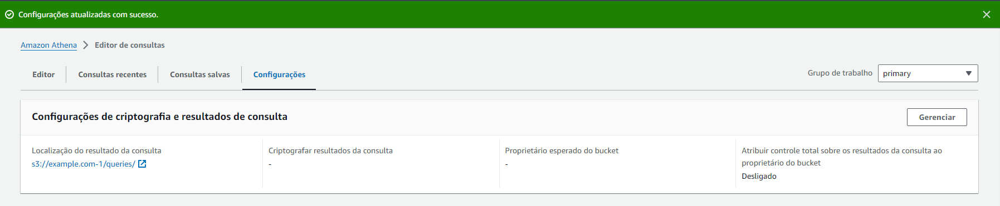
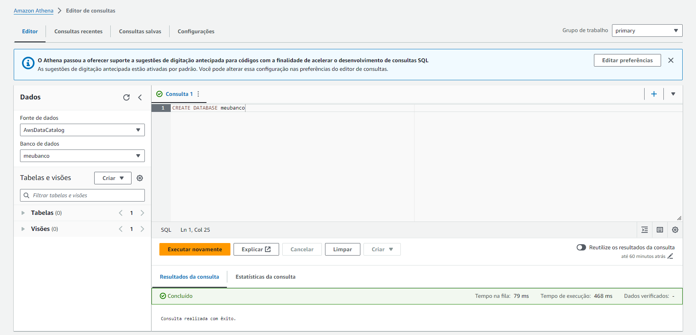
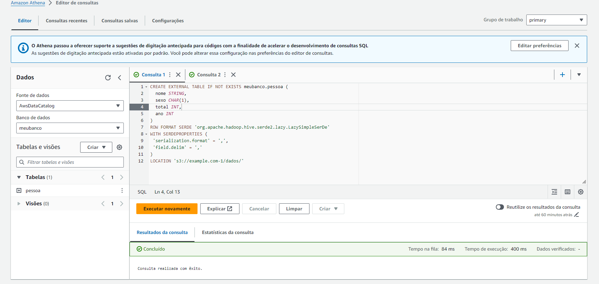
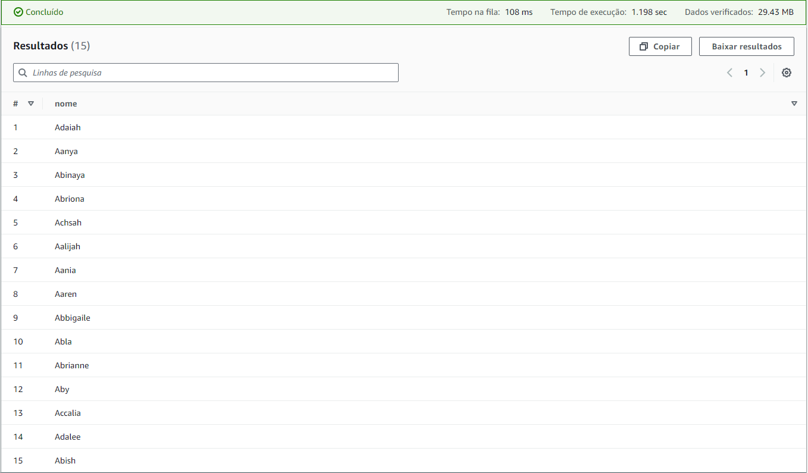
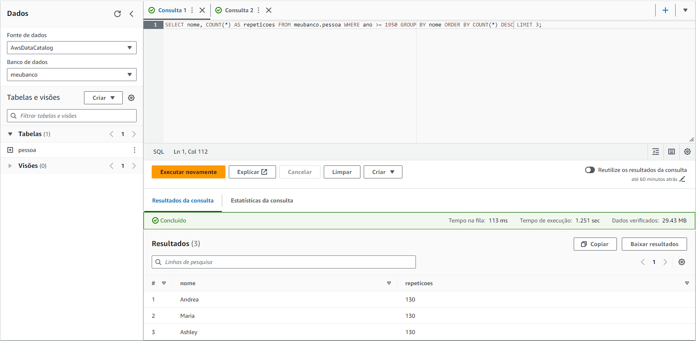

# Passo a Passo do Lab Athena

1. Criação da pasta queries dentro do bucket S3 example.com-1, criado no Lab S3, e configuração dessa pasta como destino do resultado das queries:
   

2. Criação do banco de dados meubanco no editor de consultas do Amazon Athena:
   

3. Criação da tabela externa pessoa no banco de dados meubanco seguindo o template do Lab:
   

4. Resultado da seguinte query de teste:

```sql
select nome from meubanco.pessoa where ano = 1999 order by total limit 15;
```



5. Consulta que lista os 3 nomes mais usados em cada década desde o 1950 até hoje e seu resultado:
   
