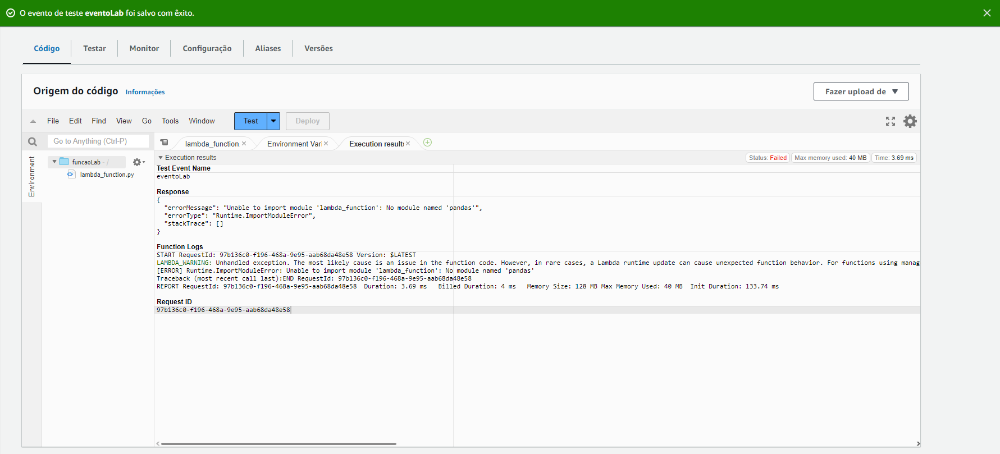

# Passo a Passo do Lab Lambda

1. Criação da função funcaoLab usando o Python 3.8, pois o Python 3.7 não está mais disponível como opção de runtime no Lambda e a atualização 3.8 é a mais próxima dessa:
   

2. Construção e deployment do código que acessa o S3 e utiliza a biblioteca Numpy e Pandas para realizar a operação, presente no Lab:
   

3. Mensagem de erro apresentada ao se selecionar a opção Test, pois o Lambda não possui a biblioteca Pandas:
   

4. Código da imagem Docker com a função de acessar o OS Linux específico da Amazon, instalar o Python e a ferramenta de compressão dos dados. A imagem foi devidamente alterada para funcionar com o Python 3.8, inclusive sendo necessária a instalação da biblioteca amazon-linux-extras para que a imagem fosse construída de forma bem-sucedida, como é possível ver abaixo:
   

5. Criação da camada PandasLayer contendo o arquivo minha-camada-pandas.zip, obtido após os passos da Etapa 3 do Lab:
   

6. Adição da camada PandasLayer à função funcaoLab:
   

7. Execução bem-sucedida do Test após a adição da camada PandasLayer:
   
