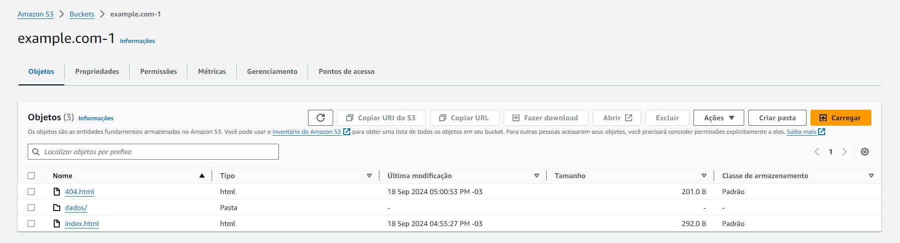

# Passo a Passo do Lab S3

1. Criação do bucket example.com-1, pois example.com não estava disponível:
   

2. Habilitação da opção "Hospedagem de site estática", com a adição dos documentos de índice "index.html" e de erro "404.html", os quais apareceram em passos seguintes:
   

3. Todo acesso público permitido:
   

4. Adição de política de bucket para tornar o conteúdo do bucket público:
   

5. Adição de arquivo HTML de índice e pasta contendo o CSV de nomes ao bucket:
   

6. Adição de arquivo HTML de erros ao bucket:
   

7. Teste do site gerado:
   
